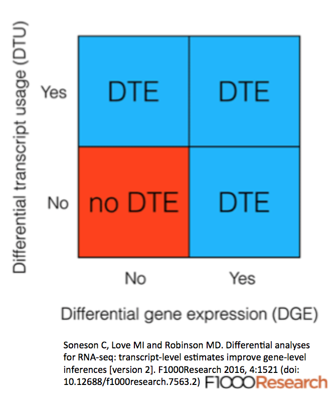

# Differential Transcript Usage via SuperTranscripts

Using [SuperTranscripts](SuperTranscripts), we can explore differential transcript usage (DTU).  Differential transcript usage analysis is complementary to differential gene expression (DGE) and differential transcript expression (DTE) analysis.  For details on how DTU, DGE, and DTE compare, see ["Differential analyses for RNA-seq: transcript-level estimates improve gene-level inferences" by Soneson, Love, and Robinson; F1000 2016](https://f1000research.com/articles/4-1521/v2).  A figure from this paper shown below illustrates the differences between them.

In short, DTU always involves DTE but not always DGE;  in the case of isoform switching, it's possible for the overall output of gene expression to remain the same but different isoforms will be expressed.  As shown in [Davidson et al.](https://genomebiology.biomedcentral.com/articles/10.1186/s13059-017-1284-1), by applying [DEX-Seq](https://bioconductor.org/packages/release/bioc/html/DEXSeq.html) to Supertranscripts, we can explore differential transcript usage via different transcript segments showing up with statistically significant differences in read coverage in response to some condition or treatment.

In addition to Trinity, to run this you will need to have the [STAR](https://github.com/alexdobin/STAR/releases) or [HISAT2](https://ccb.jhu.edu/software/hisat2/manual.shtml) aligner installed, in addition to the [featureCounts](http://bioinf.wehi.edu.au/featureCounts/) software that's part of the [Subread](https://academic.oup.com/nar/article/41/10/e108/1075719/The-Subread-aligner-fast-accurate-and-scalable) package.  Just ensure that the 'featureCounts' utility is available via your PATH setting.

The mini-pipeline for performing DTU analysis involves aligning reads the SuperTranscripts, counting the reads that align to 'exonic' regions, and performing an exon-level differential expression analysis.  These steps are encapsulated within a Trinity script that wraps aligners STAR or HISAT2 along with DEXseq, and assuming you have these tools installed, you can run it like so:

    %  $TRINITY_HOME/Analysis/SuperTranscripts/DTU/dexseq_wrapper.pl \
           --genes_fasta SuperTranscripts.fa \
           --genes_gtf SuperTranscripts.gtf \
           --samples_file samples.txt \
           --out_prefix DTU --aligner STAR

>See full usage info with '-h' for setting strand-specificity or other options.

The samples.txt file is the same one you would use with Trinity assembly and other Trinity-associated utilities, having format:

Paired end reads:

    sample_name  replicate_name /path/to/left.fq.gz  /path/to/right.fq.gz
    ...

Single end reads:

    sample_name  replicate_name /path/to/single.fq.gz
    ...

The above process aligns each of the read sets to the SuperTranscripts using the specified aligner, and then performs feature counting and differential transcript usage using DEXseq.

The result file: 'DTU.dexseq.results.dat' contains the raw DEXseq output in tab-delimited format, with exonic regions sorted according to 'padj' (the FDR-corrected p-value for significance).

For example, viewing a subset of the columns of interest from this file:

    % cat dexseq.results.dat | cut -f1,2,7,10 | column -t | less

.

    groupID          featureID   padj                  log2fold_sB_sA
    sqd:E006         sqd         1.77773417496183e-77  20.9791701992945
    S-Lap3:E002      S-Lap3      3.27420074623094e-58  53.0487043458099
    S-Lap3:E001      S-Lap3      3.93162946048046e-54  25.8634268068934
    ctp:E004         ctp         7.40560272552445e-43  26.218410640027
    CG14995:E004     CG14995     6.62799181657295e-40  23.7482827327878
    Tm1:E030         Tm1         3.72740445865008e-33  21.4484138080028
    CG30438:E003     CG30438     2.98133625644654e-28  13.5721298065012
    Klp10A:E007      Klp10A      5.03531947775949e-28  28.011361484353
    ctp:E005         ctp         3.45949051536302e-27  32.1819007006787
    CG12581:E004     CG12581     1.505698612824e-25    12.6162782771468
    Eno:E005         Eno         2.45975995945433e-25  25.6659017433562
    Aldh-III:E015    Aldh-III    6.4950906471475e-25   6.42459538549706
    Dgk:E001         Dgk         6.48417116049532e-24  3.24257501898235

>Note, the DEXseq analysis code is written to a '*.dexseq.Rscript' file.  You can further customize your DEXseq analysis by editing and rerunning that code in R.

