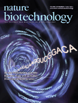

# RNA-Seq De novo Assembly Using Trinity

## Quick Guide for the Impatient

Trinity assembles transcript sequences from Illumina RNA-Seq data.

Download Trinity [here](https://github.com/trinityrnaseq/trinityrnaseq/releases).

Build Trinity by typing 'make' in the base installation directory.

Assemble RNA-Seq data like so:

     Trinity --seqType fq --left reads_1.fq --right reads_2.fq --CPU 6 --max_memory 20G 

Find assembled transcripts as:  'trinity_out_dir/Trinity.fasta'

Use the documentation links in the right-sidebar to navigate this documentation, and contact our [Google group for technical support](#contact_us).

## Intro to Trinity

Trinity, developed at the [Broad Institute](http://www.broadinstitute.org) and the [Hebrew University of Jerusalem](http://www.cs.huji.ac.il), represents a novel method for the efficient and robust de novo reconstruction of transcriptomes from RNA-seq data. Trinity combines three independent software modules: Inchworm, Chrysalis, and Butterfly, applied sequentially to process large volumes of RNA-seq reads. Trinity partitions the sequence data into many individual de Bruijn graphs, each representing the transcriptional complexity at a given gene or locus, and then processes each graph independently to extract full-length splicing isoforms and to tease apart transcripts derived from paralogous genes.  Briefly, the process works like so:

- *Inchworm* assembles the RNA-seq data into the unique sequences of transcripts, often generating full-length transcripts for a dominant isoform, but then reports just the unique portions of alternatively spliced transcripts.

- *Chrysalis* clusters the Inchworm contigs into clusters and constructs complete de Bruijn graphs for each cluster.  Each cluster represents the full transcriptonal complexity for a given gene (or sets of genes that share sequences in common).  Chrysalis then partitions the full read set among these disjoint graphs.

- *Butterfly* then processes the individual graphs in parallel, tracing the paths that reads and pairs of reads take within the graph, ultimately reporting full-length transcripts for alternatively spliced isoforms, and teasing apart transcripts that corresponds to paralogous genes.

## Trinity Publications

Trinity was published in [Nature Biotechnology](http://www.ncbi.nlm.nih.gov/pmc/articles/PMC3571712/).  Our protocol for transcriptome assembly and downstream analysis is published in [Nature Protocols](http://www.ncbi.nlm.nih.gov/pmc/articles/PMC3875132/), although we always have the most current instructional material available here at the Trinity website.

## Trinity Software Downloads

The Trinity software package can be downloaded [here on GitHub](https://github.com/trinityrnaseq/trinityrnaseq/releases). Legacy versions (pre-2015) are still available at [our Sourceforge Trinity software archive](http://sourceforge.net/projects/trinityrnaseq/files/PREV_CONTENTS/previous_releases/).

[Runtime and transcript reconstruction performance stats](http://trinityrnaseq.github.io/performance/) are available for current and previous releases.

## Trinity Training Materials

[Screenast videos](http://www.broadinstitute.org/partnerships/education/broade/trinity-screencast) are available to introduce you to Trinity and its various components. 

Also, hands-on tutorials for Trinity and Tuxedo are available as part of our [RNA-Seq Analysis Workshop](https://github.com/trinityrnaseq/RNASeq_Trinity_Tuxedo_Workshop/wiki).

## Contact Us

Questions, suggestions, comments, etc?

Join and add discussions at the Trinityrnaseq-users Google group: <https://groups.google.com/forum/#!forum/trinityrnaseq-users>.

## Referencing Trinity

Trinity can be referenced as:

- Grabherr MG, Haas BJ, Yassour M, Levin JZ, Thompson DA, Amit I, Adiconis X, Fan L, Raychowdhury R, Zeng Q, Chen Z, Mauceli E, Hacohen N, Gnirke A, Rhind N,
di Palma F, Birren BW, Nusbaum C, Lindblad-Toh K, Friedman N, Regev A.
Full-length transcriptome assembly from RNA-seq data without a reference genome. 
[Nat Biotechnol. 2011 May 15;29(7):644-52](http://www.nature.com/nbt/journal/vaop/ncurrent/abs/nbt.1883.html). doi: 10.1038/nbt.1883. 
[PubMed PMID: 21572440](http://www.ncbi.nlm.nih.gov/pubmed/21572440).

Protocol for using Trinity for de novo transcriptome assembly and downstream analyses:

- Haas BJ, Papanicolaou A, Yassour M, Grabherr M, Blood PD, Bowden J, Couger MB,
Eccles D, Li B, Lieber M, Macmanes MD, Ott M, Orvis J, Pochet N, Strozzi F, Weeks
N, Westerman R, William T, Dewey CN, Henschel R, Leduc RD, Friedman N, Regev A.
De novo transcript sequence reconstruction from RNA-seq using the Trinity
platform for reference generation and analysis. [Nat Protoc. 2013 Aug;8(8):1494-512](http://www.nature.com/nprot/journal/v8/n8/full/nprot.2013.084.html). [Open Access in PMC](http://www.ncbi.nlm.nih.gov/pmc/articles/PMC3875132/) doi: 10.1038/nprot.2013.084. Epub 2013 Jul 11. PubMed PMID:23845962.

Performance tuning of Trinity is described in:

- Henschel R, Lieber M, Wu L, Nista, PM, Haas BJ, LeDuc R.  Trinity RNA-Seq assembler performance optimization. XSEDE 2012 Proceedings of the 1st Conference of the Extreme Science and Engineering Discovery Environment: Bridging from the eXtreme to the campus and beyond. [ISBN: 978-1-4503-1602-6 doi: 10.1145/2335755.2335842](http://dx.doi.org/10.1145/2335755.2335842).

## Funding for Trinity Development

Trinity development is funded by [ITCR](http://itcr.nci.nih.gov/).

Our efforts related to building a Trinity Cancer Transcriptome Analysis Toolkit are described in this Youtube screencast:

