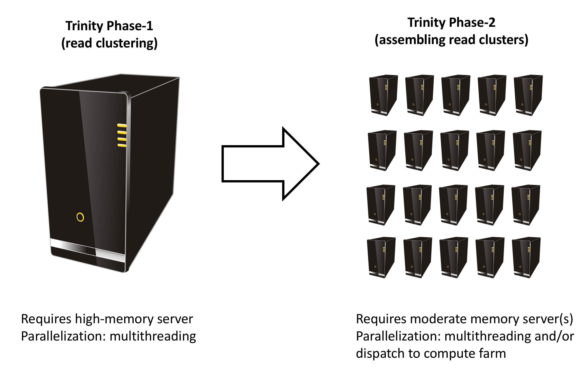

Quick links:
-  [Running Trinity](#running_trinity)
-  [Strand-specific Assembly](#strand_specific_assembly)
-  [A typical Trinity command](#typical_trinity_command_line)
-  [Quality trimming using Trimmomatic](#trimmomatic)
-  [In silico normalization of reads](#insilinorm)
-  [Minimizing Falsely Fused Transcripts Derived from Gene Dense Genomes](#jaccard_clip)
-  [Adapting Trinity to a computing grid for massively parallel processing](#grid_conf)
-  [Running Trinity in multiple sequential stages](#staged_exec)

# Running Trinity

Trinity is run via the script: 'Trinity' found in the base installation directory.

Usage info is as follows:

     ###############################################################################
     #
     #     ______  ____   ____  ____   ____  ______  __ __
     #    |      ||    \ |    ||    \ |    ||      ||  |  |
     #    |      ||  D  ) |  | |  _  | |  | |      ||  |  |
     #    |_|  |_||    /  |  | |  |  | |  | |_|  |_||  ~  |
     #      |  |  |    \  |  | |  |  | |  |   |  |  |___, |
     #      |  |  |  .  \ |  | |  |  | |  |   |  |  |     |
     #      |__|  |__|\_||____||__|__||____|  |__|  |____/ 
     #
     ###############################################################################
     #
     # Required:
     #
     #  --seqType <string>      :type of reads: ( fa, or fq )
     #
     #  --max_memory <string>      :suggested max memory to use by Trinity where limiting can be enabled. (jellyfish, sorting, etc)
     #                            provided in Gb of RAM, ie.  '--max_memory 10G'
     #
     #  If paired reads:
     #      --left  <string>    :left reads, one or more file names (separated by commas, not spaces)
     #      --right <string>    :right reads, one or more file names (separated by commas, not spaces)
     #
     #  Or, if unpaired reads:
     #      --single <string>   :single reads, one or more file names, comma-delimited (note, if single file contains pairs, can use flag: --run_as_paired )
     #
     #  Or,
     #      --samples_file <string>         tab-delimited text file indicating biological replicate relationships.
     #                                   ex.
     #                                        cond_A    cond_A_rep1    A_rep1_left.fq    A_rep1_right.fq
     #                                        cond_A    cond_A_rep2    A_rep2_left.fq    A_rep2_right.fq
     #                                        cond_B    cond_B_rep1    B_rep1_left.fq    B_rep1_right.fq
     #                                        cond_B    cond_B_rep2    B_rep2_left.fq    B_rep2_right.fq
     #
     #                      # if single-end instead of paired-end, then leave the 4th column above empty.
     #
     ####################################
     ##  Misc:  #########################
     #
     #  --SS_lib_type <string>          :Strand-specific RNA-Seq read orientation.
     #                                   if paired: RF or FR,
     #                                   if single: F or R.   (dUTP method = RF)
     #                                   See web documentation.
     #
     #  --CPU <int>                     :number of CPUs to use, default: 2
     #  --min_contig_length <int>       :minimum assembled contig length to report
     #                                   (def=200)
     #
     #  --long_reads <string>           :fasta file containing error-corrected or circular consensus (CCS) pac bio reads
     #
     #  --genome_guided_bam <string>    :genome guided mode, provide path to coordinate-sorted bam file.
     #                                   (see genome-guided param section under --show_full_usage_info)
     #
     #  --jaccard_clip                  :option, set if you have paired reads and
     #                                   you expect high gene density with UTR
     #                                   overlap (use FASTQ input file format
     #                                   for reads).
     #                                   (note: jaccard_clip is an expensive
     #                                   operation, so avoid using it unless
     #                                   necessary due to finding excessive fusion
     #                                   transcripts w/o it.)
     #
     #  --trimmomatic                   :run Trimmomatic to quality trim reads
     #                                        see '--quality_trimming_params' under full usage info for tailored settings.
     #                                  
     #
     #  --no_normalize_reads            :Do *not* run in silico normalization of reads. Defaults to max. read coverage of 50.
     #                                       see '--normalize_max_read_cov' under full usage info for tailored settings.
     #                                       (note, as of Sept 21, 2016, normalization is on by default)
     #
     #     
     #
     #  --output <string>               :name of directory for output (will be
     #                                   created if it doesn't already exist)
     #                                   default( your current working directory: "/Users/bhaas/GITHUB/trinityrnaseq/trinity_out_dir" 
     #                                    note: must include 'trinity' in the name as a safety precaution! )
     #  
     #  --full_cleanup                  :only retain the Trinity fasta file, rename as ${output_dir}.Trinity.fasta 
     #
     #  --cite                          :show the Trinity literature citation
     #
     #  --version                       :reports Trinity version (BLEEDING_EDGE) and exits.
     #
     #  --show_full_usage_info          :show the many many more options available for running Trinity (expert usage).
     #
     #
     ###############################################################################
     #
     #  *Note, a typical Trinity command might be:
     #
     #        Trinity --seqType fq --max_memory 50G --left reads_1.fq  --right reads_2.fq --CPU 6
     # 
     #
     #    and for Genome-guided Trinity:
     #
     #        Trinity --genome_guided_bam rnaseq_alignments.csorted.bam --max_memory 50G
     #                --genome_guided_max_intron 10000 --CPU 6
     #
     #     see: /Users/bhaas/GITHUB/trinityrnaseq/sample_data/test_Trinity_Assembly/
     #          for sample data and 'runMe.sh' for example Trinity execution
     #
     #     For more details, visit: http://trinityrnaseq.github.io
     #
     ###############################################################################

<a name='strand_specific_assembly'>
Trinity performs best with strand-specific data, in which case sense and antisense transcripts can be resolved.  For protocols on strand-specific RNA-Seq, see: [Borodina T, Adjaye J, Sultan M. A strand-specific library preparation protocol for RNA sequencing. Methods Enzymol. 2011;500:79-98. PubMed PMID: 21943893](http://www.ncbi.nlm.nih.gov/pubmed/21943893).

If you have strand-specific data, specify the library type.  There are four library types:

- Paired reads:
    * *RF*: first read (/1) of fragment pair is sequenced as anti-sense (reverse(*R*)), and second read (/2) is in the sense strand (forward(*F*)); typical of the dUTP/UDG sequencing method.
    * *FR*: first read (/1) of fragment pair is sequenced as sense (forward), and second read (/2) is in the antisense strand (reverse)

- Unpaired (single) reads:
    * *F*: the single read is in the sense (forward) orientation
    * *R*: the single read is in the antisense (reverse) orientation

By setting the *--SS_lib_type* parameter to one of the above, you are indicating that the reads are strand-specific.  By default, reads are treated as not strand-specific.

Other important considerations:

- Whether you use Fastq or Fasta formatted input files, be sure to keep the reads oriented as they are reported by Illumina, if the data are strand-specific. This is because, Trinity will properly orient the sequences according to the specified library type.  If the data are not strand-specific, no worries because the reads will be parsed in both orientations.

- If you have both paired and unpaired data, and the data are NOT strand-specific, you can combine the unpaired data with the left reads of the paired fragments.  Be sure that the unpaired reads have a /1 as a suffix to the accession value similarly to the left fragment reads.  The right fragment reads should all have /2 as the accession suffix.  Then, run Trinity using the --left and --right parameters as if all the data were paired.

- If you have multiple paired-end library fragment sizes, set the '--group_pairs_distance' according to the larger insert library.  Pairings that exceed that distance will be treated as if they were unpaired by the Butterfly process.  

- by setting the '--CPU option', you are indicating the maximum number of threads to be used by processes within Trinity. Note that Inchworm alone will be internally capped at 6 threads, since performance will not improve for this step beyond that setting)

## Typical Trinity Command Line

A typical Trinity command for assembling non-strand-specific RNA-seq data would be like so, running the entire process on a single high-memory server (aim for ~1G RAM per ~1M ~76 base Illumina paired reads, but often *much* less memory is required):

Run Trinity like so:

     Trinity --seqType fq --max_memory 50G \
             --left reads_1.fq.gz  --right reads_2.fq.gz --CPU 6

If you have multiple sets of fastq files, such as corresponding to multiple tissue types or conditions, etc., you can indicate them to Trinity like so:

     Trinity --seqType fq --max_memory 50G  \
             --left condA_1.fq.gz,condB_1.fq.gz,condC_1.fq.gz \
             --right condA_2.fq.gz,condB_2.fq.gz,condC_2.fq.gz \
             --CPU 6  

or better yet, create a 'samples.txt' file that describes the data like so:

     #      --samples_file <string>         tab-delimited text file indicating biological replicate relationships.
     #                                   ex.
     #                                        cond_A    cond_A_rep1    A_rep1_left.fq    A_rep1_right.fq
     #                                        cond_A    cond_A_rep2    A_rep2_left.fq    A_rep2_right.fq
     #                                        cond_B    cond_B_rep1    B_rep1_left.fq    B_rep1_right.fq
     #                                        cond_B    cond_B_rep2    B_rep2_left.fq    B_rep2_right.fq

This same samples file can then be used later on with other downstream analysis steps, including expression quantification and differential expression analysis.

>note that fastq files can be gzip-compressed as shown above, in which case they should require a '.gz' extension.

## Options to Consider when Running Trinity 

Trinity includes additional options to automate various aspects of RNA-Seq read processing that should be considered prior to executing the de novo assembly. This includes quality trimming of reads using [Trimmomatic](http://www.usadellab.org/cms/?page=trimmomatic), or in silico normalization of the total reads to reduce the number of reads that are subject to de novo assembly, improving on assembly run-time.  Also, if transcripts are derived from a compact genome where overlapping UTRs are common, options are provided to mitigate the assembly of falsely end-to-end fused transcripts by analyzing the consistency of the read pairings across the length of the transcripts. These options are each detailed below.

#### Quality trimming using Trimmomatic
To perform quality trimming of inputted fastq files, use 'Trinity --trimmomatic'.  The default settings for quality trimming are described under the full usage info for Trinity (use 'Trinity --show_full_usage_info' for complete usage info):

     ################################################################################
     #### Quality Trimming Options ####  
     # 
     #  --quality_trimming_params <string>   defaults to: \
     #    "ILLUMINACLIP:$TRIMMOMATIC_DIR/adapters/TruSeq3-PE.fa:2:30:10 SLIDINGWINDOW:4:5 LEADING:5 TRAILING:5 MINLEN:25"
     #
     ################################################################################

The various options that are available for the Trimmomatic software are described on the [Trimmomatic software website](http://www.usadellab.org/cms/?page=trimmomatic).  The Trimmomatic software is bundled as a trinity plugin for convenience.

The default settings used are based on work performed by Matt MacManes and published as ["On the optimal trimming of high-throughput mRNA sequence data", Front. Genet., 31 January 2014 | http://dx.doi.org/10.3389/fgene.2014.00013](http://journal.frontiersin.org/article/10.3389/fgene.2014.00013/abstract).

If --trimmomatic is enabled, it will generate quality-trimmed outputs in the output directory and these will be used for assembly.  For example, in running Trinity with --trimmomatic --left reads.left.fq.gz  --right reads.right.fq.gz ...

With paired reads, there will tend to be cases where both reads in the pair are quality trimmed (P) and cases where one of the paired reads was discarded and one was kept (U). The reads are separated accordingly into the following files:

we find the output files (P or U specified accordingly as described above):

    reads.left.fq.gz.P.qtrim.gz     
    reads.left.fq.gz.U.qtrim.gz
    reads.right.fq.gz.P.qtrim.gz
    reads.right.fq.gz.U.qtrim.gz

and Trinity will leverage the properly paired (P) reads for assembly, after first running the in silico normalization on the trimmed reads as described below.

### Assembling Large RNA-Seq Data Sets (hundreds of millions to billions of reads)

>Note, as of Nov, 2016, in silico normalization in Trinity happens by default.

If you have especially large RNA-Seq data sets involving many hundreds of millions of reads to billions of reads, in silico normalization is a necessity.

Options related to in silico normalization include:

    #  --no_normalize_reads            :Do *not* run in silico normalization of reads. Defaults to max. read coverage of 50.
    #                                       see '--normalize_max_read_cov' under full usage info for tailored settings.
    #                                       (note, as of Sept 21, 2016, normalization is on by default)
    #
    ################################################################################ 
    ####  In silico Read Normalization Options ###
    #
    #  --normalize_max_read_cov <int>       defaults to 50
    #  --normalize_by_read_set              run normalization separate for each pair of fastq files,
    #                                       then one final normalization that combines the individual normalized reads.
    #                                       Consider using this if RAM limitations are a consideration.
    #

If you are interested in running the normalization utility outside of Trinity, you can run it directly as described: [Trinity Insilico Normalization](Trinity Insilico Normalization).  

### Minimizing Falsely Fused Transcripts Derived from Gene Dense Genomes (using --jaccard_clip) 

If your transcriptome RNA-seq data are derived from a gene-dense compact genome, such as from fungal genomes, where transcripts may often overlap in UTR regions, you can minimize fusion transcripts by leveraging the '--jaccard_clip' option if you have paired reads.  Trinity will examine the consistency of read pairings and fragment transcripts at positions that have little read-pairing support.  In expansive genomes of vertebrates and plants, this is unnecessary and not recommended.  In compact fungal genomes, it is highly recommended.  As part of this analysis, reads are aligned to the Inchworm contigs, read pairings are examined across the Inchworm contigs, and contigs are clipped at positions of low pairing support.  These clipped Inchworm contigs are then fed into Chrysalis for downstream processing.  

>Note, by using strand-specific RNA-Seq data alone, you should greatly mitigate the incorrect fusion of minimally overlapping transcripts.

## [OPTIONAL] Adapting Trinity to a computing grid for massively parallel processing of embarrassingly parallel steps

Trinity has many parallel-components, all of which can benefit from having multiple CPUs on a single server, but there are also cases such as in Chrysalis and Butterfly where tens of thousands to hundreds of thousands of commands can be executed in parallel, each having independent inputs and outputs.  These naively-parallel commands can be most efficiently computed in the context of a compute farm, submitting each of the commands (or batches of them) to individual nodes on the computing grid.  

To launch the parallel jobs onto your computing grid, you (simply?) need to have a way of launching a set of commands onto your computing platform.  This should be a script that you have (or write) that can take a single parameter:  a file that contains the list of commands to execute.   It should also ensure that all commands complete successfully.  Specify the path to your script via the '--grid_exec' parameter.  This is described in the Trinity usage (under Trinity --show_full_usage_info) as so:

    #  --grid_exec <string>                 :your command-line utility for submitting jobs to the grid.
    #                                        This should be a command line tool that accepts a single parameter:
    #                                        ${your_submission_tool} /path/to/file/containing/commands.txt
    #                                        and this submission tool should exit(0) upon successful 
    #                                        completion of all commands.
    #
    #  --grid_node_CPU <int>                number of threads for each parallel process to leverage. (default: 1)
    #
    #  --grid_node_max_memory <string>         max memory targeted for each grid node. (default: 1G)
    #
    #            The --grid_node_CPU and --grid_node_max_memory are applied as 
    #              the --CPU and --max_memory parameters for the Trinity jobs run in 
    #              Trinity Phase 2 (assembly of read clusters)
    #
    #

The required Trinity '--CPU' parameter determines the amount of multithreading that happens during Phase-1 as shown above.   If Phase-2 is going to be run on that same individual high-mem server (default), then this same '--CPU' parameter will determine the number of simultaneous Phase-2 commands that will be launched.

>Note, the --grid_node_CPU and --grid_node_max_memory parameters indicate how many cores and amount of RAM that should be used by each of the spawned Phase-2 commands.  These commands typically do not need more than 1 core or much RAM, and so you are encouraged to keep the default parameter values here. 

If you're interested in using a flexible grid submission system to facilitate submissions of the Phase-2 jobs to a computing grid, you might have a look at <http://hpcgridrunner.github.io/>.  

If you use [HPC GridRunner](http://hpcgridrunner.github.io) with Trinity, the command would look like so:

    Trinity ...  --grid_exec "/path/to/hpc_cmds_GridRunner.pl --grid_conf your_grid_conf -c"

See the [HPC GridRunner documentation](http://hpcgridrunner.github.io) for info related to configuring it for use with your compute farm.  So far, we've had successful reports of use with LSF, SGE, SLURM, and PBS, and example configurations are provided.  

>Be sure to explore and test running HPC GridRunner before wiring it up to Trinity.

## Running Trinity in multiple sequential stages

If you want to run Trinity in multiple sequential phases, you can do so using the following staged execution:

     # just run the initial in silico normalization step and kmer counting:
     Trinity (opts) --no_run_inchworm

     # run inchworm, stop before chrysalis
     Trinity (opts) --no_run_chrysalis

     # run chrysalis, stop before Trinity phase 2 parallel assembly of clustered reads
     Trinity (opts) --no_distributed_trinity_exec

     # finish the job, running all Phase 2 mini-assemblies in parallel:
     Trinity (opts) 

>the (opts) just refers to the standard options you would include with trinity, including --seqType, --max_memory, --CPU, etc.

