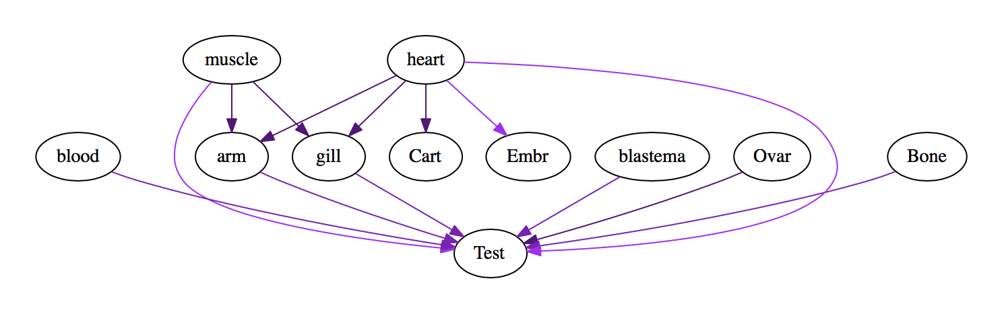

# Sample-Specific Expression Analysis in Many Sample Comparisons

If you have many samples that you've compared in pairwise comparisons, you may be interested in those transcripts that are consistently up- or down-regulated in certain samples or sets of samples.   This is the case when exploring a tissue-specificity analysis where you may have RNA-Seq data sets from a number of different samples.  In Trinity, we have a framework we developed for doing this, which we leveraged for our analysis of the [Axolotl transcriptome](http://www.cell.com/cell-reports/abstract/S2211-1247(16)31770-3).

Before following the protocol below, you should have performed a [differential expression analysis](Trinity-Differential-Expression) at the gene or transcript level.  For the steps below, we'll use a transcript differential expression analysis as our example.  If you decide to explore this at the gene level, operations are identical, but use the gene-relevant files instead of the isoform-relevant files (DE results and expression matrix).

## Average expression across sample replicates

We'll want an expression matrix where each sample type (eg. tissue; column in the matrix) is represented by a single expression value per transcript.

Run the following to create a new expression matrix with replicate values averaged.

>Be sure to run all operations from within your differential expression analysis directory (contains *.DE_results files).

    %  ${TRINITY_HOME}/Analysis/DifferentialExpression/replicates_to_sample_averages_matrix.pl \
        --matrix ../Trinity_trans.TMM.EXPR.matrix \
        --samples_file ../samples.txt \
        --avg_log_val

The above should create a new file:  ../Trinity_trans.TMM.EXPR.matrix.avg_reps.matrix

## Differential Expression Pairwise Summary

Generate a file containing a summary of all pairwise differential expression results like so:

    %  ${TRINITY_HOME}/Analysis/DifferentialExpression/TissueEnrichment/DE_results_to_pairwise_summary.pl \
           ../Trinity_trans.TMM.EXPR.matrix.avg_reps.matrix   ./. \
           > DE_pairwise_summary.txt

>Don't forget that last dotslashdot above.

The output of this file will be formatted like so:

```
#feature        sample_A        sample_B        log2(exprA)     log2(exprB)     logFC   FDR
c1091186_g4_i1  arm     blastema        0.335711910320462       7.68823631929526        -7.35   1.58651950120504e-57
c1088792_g2_i5  arm     blastema        0       4.77220238744118        -4.77   8.15949069904939e-48
c1089919_g4_i6  arm     blastema        0       4.9486475661359 -4.95   9.5919885002361e-45
...
c1047730_g1_i1  Cart    arm     0.0285691521967709      0.709290635723358       -0.68   3.17036176303981e-07
c1078993_g1_i1  Cart    arm     0       1.51450103627429        -1.51   3.17283206191388e-07
c1075446_g5_i3  Cart    arm     0.554834395894193       2.79243893006464        -2.24   3.1809690294856e-07
c1087416_g10_i1 Cart    arm     0.556797246592743       0.0143552929770701      0.54    3.18312492779281e-07
...
c876107_g1_i1   Test    muscle  0.420078115979374       2.09423606984577        -1.67   0.0260090138780854
c1074311_g2_i1  Test    muscle  0.146655222119465       2.08780225897709        -1.94   0.0260139325619818
c1002566_g2_i1  Test    muscle  0       0.372952097911829       -0.37   0.0260142007511727
c1054854_g2_i2  Test    muscle  2.28362550060704        0.652601217596519       1.63    0.0260218965862368
c1083042_g3_i4  Test    muscle  8.41937034252815        5.7198953011051 2.70    0.0260288472488345
c1046447_g3_i1  Test    muscle  9.08818135780396        6.38967005437391        2.70    0.0260347614834019
...
```

The logFC column indicates the log2 fold change of (sampleA)/(sampleB), and will be positive when a transcript is up-regulated in sampleA as compared to sampleB.

## Identifying Tissue-enriched transcripts

Based on the pairwise summaries, we can build a directed graph of the up vs. down regulation patterns across samples like so:

    %   ${TRINITY_HOME}/Analysis/DifferentialExpression/TissueEnrichment/pairwise_DE_summary_to_DE_classification.pl \
            DE_pairwise_summary.txt

Running this will generate several output files, each described below:

### DE_pairwise_summary.txt.graph

The .graph file lists each pair of conditions having significant differential expression along with the log2 fold change according to each transcript.  

Example:

    transcript (tab)  sampleA,sampleB,logFC  ...   

where sampleA > sampleB in each 

The top part of our axolotl differential expression comparison graph file is below:

```
c869509_g1_i1   Cart,arm,0.3
c1058151_g1_i1  blastema,Cart,0.22      blastema,heart,0.27     blastema,Ovar,0.27      blastema,blood,0.27     blastema,arm,0.25
c1080153_g4_i1  heart,Cart,2.82 heart,Embr,2.87 heart,blood,2.72        heart,Bone,2.87 heart,Test,2.87 heart,Ovar,2.87 heart,gill,2.87 heart,arm,2.87  heart,blastema,2.87     heart,muscle,2.87
c1063956_g1_i1  gill,Test,2.5   arm,Test,2.7    muscle,Test,4.73        muscle,gill,2.23        muscle,arm,2.03 blastema,Test,2.69      Ovar,Test,2.23  Bone,Test,2.78  heart,Test,4.57 heart,Embr,4.51 heart,Cart,2.34 heart,arm,1.87  heart,gill,2.07 blood,Test,3.26
c1085566_g1_i1  blastema,gill,0.52      blastema,arm,0.52       blastema,Ovar,0.63
c1060165_g5_i3  Embr,Cart,0.37  Embr,muscle,0.37        Embr,blastema,0.36      Embr,arm,0.37   Test,blastema,1.28      Test,muscle,1.28        Test,arm,1.28   Test,gill,1.28  Test,heart,1.22 Test,Bone,1.24  Test,Ovar,1.25  Test,blood,1.2  Test,Cart,1.28
...
```

### DE_pairwise_summary.txt.class_up_priority

The DE_pairwise_summary.txt.class_up_priority file organizes the data according to sets of upregulated vs. downregulated tissue types.  An example is shown below, with the formatting:

    transcript (tab) up-regulated-set (tab) down-regulated-set

```
c1078234_g4_i3  Test    Bone,Cart,Ovar,arm,blastema,gill,heart,muscle
c1085201_g2_i2  Ovar    Bone,Cart,Test,arm,blastema,muscle
c1076995_g2_i2  gill    Bone,Cart,arm,blastema,blood,heart,muscle
c1071189_g4_i1  Embr    Bone,Test,arm,blood,gill,heart
c950959_g1_i1   muscle  arm,blastema
c1077970_g2_i1  Bone,blastema,gill      arm
c941771_g1_i1   Bone,gill       arm
c1076006_g3_i4  Embr,Ovar       Bone,Cart,Test,arm,blastema,blood,gill,heart,muscle
...
```

which you can interpret like so:

The top-most transcript listed 'c1078234_g4_i3' is up-regulated in Testes as compared to the various other tissues including Bone, Cart, Ovar, arm, blastema, gill, heart, and muscle.   So, it may very likely a Testes-enriched transcript.

Another entry 'c941771_g1_i1' is found to be upregulated in Bone and gill as compared to arm tissue. Note, because other tissues weren't included here, it may be moderately expressed in other tissues, but just not significantly differentially expressed in the pairwise comparisons.

This DE_pairwise_summary.txt.class_up_priority partitions the graph into up- vs. down-regulated transcript sets in a greedy fashion, attempting to maximize the number of different conditions found down-regulated (giving priority to the most up-regulated conditions).

>An alternative prioritization scheme is provided by file 'DE_pairwise_summary.txt.class_down_priority', where priority is given to the down-regulated genes (right side), maximizing the number of significantly up-regulated conditions.

### DE_pairwise_summary.txt.class_up_priority.ordered_by_expression 

The 'DE_pairwise_summary.txt.class_up_priority.ordered_by_expression' file is particularly useful in that it prioritizes the genes according to magnitudes of differential expression, and includes the log2(expression) value for each condition:

An example snippet is below
```
## Embr (30571)
c1063016_g1_i1  Embr(12.78)     muscle(0.00),heart(0.00),gill(0.00),blood(0.00),blastema(0.00),arm(0.00),Test(0.00),Ovar(0.00),Cart(0.00),Bone(0.00)
c230962_g1_i1   Embr(11.79)     muscle(0.00),heart(0.00),gill(0.00),blood(0.00),blastema(0.00),arm(0.00),Test(0.00),Ovar(0.00),Cart(0.00),Bone(0.00)
c1041831_g1_i1  Embr(11.71)     muscle(0.00),heart(0.00),gill(0.00),blood(0.00),blastema(0.00),arm(0.00),Test(0.00),Ovar(0.00),Cart(0.00),Bone(0.00)
c1030492_g1_i2  Embr(10.78)     arm(0.03),muscle(0.00),heart(0.00),gill(0.00),blood(0.00),blastema(0.00),Test(0.00),Ovar(0.00),Cart(0.00),Bone(0.00)
c1103606_g1_i1  Embr(9.94)      muscle(0.00),heart(0.00),gill(0.00),blood(0.00),blastema(0.00),arm(0.00),Test(0.00),Ovar(0.00),Cart(0.00),Bone(0.00)
c1083341_g3_i1  Embr(13.06)     gill(0.31),arm(0.03),muscle(0.00),heart(0.00),blood(0.00),blastema(0.00),Test(0.00),Ovar(0.00),Cart(0.00),Bone(0.00)
c1177782_g1_i1  Embr(9.49)      muscle(0.00),heart(0.00),gill(0.00),blood(0.00),blastema(0.00),arm(0.00),Test(0.00),Ovar(0.00),Cart(0.00),Bone(0.00)
c427352_g1_i1   Embr(10.09)     gill(0.08),arm(0.00),muscle(0.00),heart(0.00),blood(0.00),blastema(0.00),Test(0.00),Ovar(0.00),Cart(0.00),Bone(0.00)
c1036621_g1_i2  Embr(9.09)      muscle(0.00),heart(0.00),gill(0.00),blood(0.00),blastema(0.00),arm(0.00),Test(0.00),Ovar(0.00),Cart(0.00),Bone(0.00)
c1000953_g1_i1  Embr(8.93)      muscle(0.00),heart(0.00),gill(0.00),blood(0.00),blastema(0.00),arm(0.00),Test(0.00),Ovar(0.00),Cart(0.00),Bone(0.00)
c1083341_g3_i2  Embr(8.62)      muscle(0.00),heart(0.00),gill(0.00),blood(0.00),blastema(0.00),arm(0.00),Test(0.00),Ovar(0.00),Cart(0.00),Bone(0.00)
c1042039_g1_i1  Embr(9.93)      arm(0.24),muscle(0.00),heart(0.00),gill(0.00),blood(0.00),blastema(0.00),Test(0.00),Ovar(0.00),Cart(0.00),Bone(0.00)
```

Each tissue type (or combination of up-regulated tissue types) will have a different section header ('#') followed by the ranked tissue-specific genes.

## Graphical summary of DE organization across samples

You can generate a '.dot' graphical file of the DE relationships to explore using [Graphviz](https://www.graphviz.org/).

From the provided .graph file, grep out the line corresponding to your transcript of interest:

    %    grep c1063956_g1_i1 DE_pairwise_summary.txt.graph   >  c1063956_g1_i1.graph 

Then, create a .dot file for it like so:

    %  ${TRINITY_HOME}/Analysis/DifferentialExpression/TissueEnrichment/DE_graph_to_dot.pl  \
          c1063956_g1_i1.graph  > c1063956_g1_i1.graph.dot

You can then visualize the .dot file using graphviz:



Here you can see that the transcript is upregulated in muscle and heart, and downregulated in Testes as compared to a number of tissues.  


 
