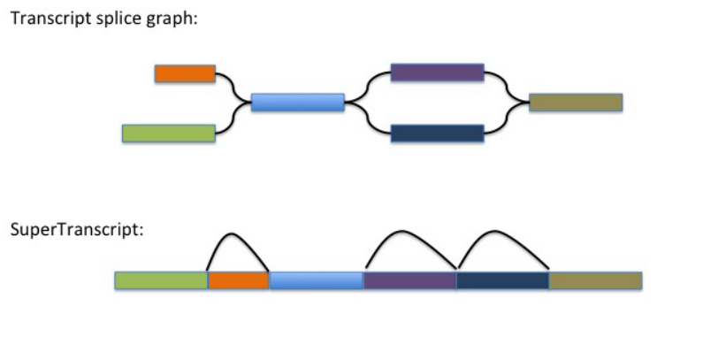

SuperTranscripts provide a gene-like view of the transcriptional complexity of a gene.  SuperTranscripts were originally defined by Nadia Davidson, Anthony Hawkins, and Alicia Oshlack as described in their publication ["SuperTranscripts: a data driven reference for analysis and visualisation of transcriptomes" Genome Biology, 2017.](https://genomebiology.biomedcentral.com/articles/10.1186/s13059-017-1284-1)  SuperTranscripts are useful in the context of genome-free de novo transcriptome assembly in that they provide a genome-like reference for studying aspects of the gene including differential transcript usage (aka. differential exon usage) and as a substrate for mapping reads and identifying allelic polymorphisms.

A SuperTranscript is constructed by collapsing unique and common sequence regions among splicing isoforms into a single linear sequence.  An illustration of this is shown below:

In the Trinity toolkit, we provide a utility for constructing SuperTranscripts based on the gene-to-isoform relationships and the sequence graph structure leveraged by Trinity during assembly.  

>Note, if you have transcriptome assemblies generated by an assembler other than Trinity, or are interested in exploring the earlier published methods, see [Lace](https://github.com/Oshlack/Lace).

Generate Trinity SuperTranscripts like so:

    %  $TRINITY_HOME/Analysis/SuperTranscripts/Trinity_gene_splice_modeler.py \
           --trinity_fasta Trinity.fasta

and this should generate two output files:

     trinity_genes.fasta   :supertranscripts in fasta format
     trinity_genes.gtf     :transcript structure annotation in gtf format

If you're interested in capturing a multiple alignment view that contrasts the different candidate splicing isoforms, you can include parameter '--incl_malign', and it'll generate a file 'trinity_genes.malign'.

An example of such a multiple alignment view is shown below:

    TRINITY_DN22_c0_g2_i5   TGTCTCTGACAAATTCTCTCCAGAGGCTGCGTCTCGGAGGGGGCTGAGCACAGCAGAGATGAATGCAGTAGAAGCCATCCACAGAGCTGTGGAATTTAAT
    TRINITY_DN22_c0_g2_i4   TGTCTCTGACAAATTCTCTCCAGAGGCTGCGTCTCGGAGGGGGCTGAGCACAGCAGAGATGAATGCAGTAGAAGCCATCCACAGAGCTGTGGAATTTAAT
    TRINITY_DN22_c0_g2_i6   TGTCTCTGACAAATTCTCTCCAGAGGCTGCGTCTCGGAGGGGGCTGAGCACAGCAGAGATGAATGCAGTAGAAGCCATCCACAGAGCTGTGGAATTTAAT
    TRINITY_DN22_c0_g2_i1   TGTCTCTGACAAATTCTCTCCAGAGGCTGCGTCTCGGAGGGGGCTGAGCACAGCAGAGATGAATGCAGTAGAAGCCATCCACAGAGCTGTGGAATTTAAT
    TRINITY_DN22_c0_g2_i3   TGTCTCTGACAAATTCTCTCCAGAGGCTGCGTCTCGGAGGGGGCTGAGCACAGCAGAGATGAATGCAGTAGAAGCCATCCACAGAGCTGTGGAATTTAAT

    TRINITY_DN22_c0_g2_i5   CCACACGTGCCAAAA......................TATCTACTAGAAATGAAAAGCTTAATCCTCCCACCAGAACACATCCTGAAGAGAGGAGACAGT
    TRINITY_DN22_c0_g2_i4   CCACACGTGCCAAAA......................TATCTACTAGAAATGAAAAGCTTAATCCTCCCACCAGAACACATCCTGAAGAGAGGAGACAGT
    TRINITY_DN22_c0_g2_i6   CCACACGTGCCAAAA......................TATCTACTAGAAATGAAAAGCTTAATCCTCCCACCAGAACACATCCTGAAGAGAGGAGACAGT
    TRINITY_DN22_c0_g2_i1   CCACACGTGCCAAAACTTTCCGGATGATCCCGTATCC...............................................................
    TRINITY_DN22_c0_g2_i3   CCACACGTGCCAAAA......................TATCTACTAGAAATGAAAAGCTTAATCCTCCCACCAGAACACATCCTGAAGAGAGGAGACAGT

    TRINITY_DN22_c0_g2_i5   GAAGCGATAGCATATGCATTCTTTCATCTTGCACACTGGAAGAGGGTGGAAGGGGCTTTGAATCTCTTGCATTGTACGTGGGAAGGCACTTTCCGGATGA
    TRINITY_DN22_c0_g2_i4   GAAGCGATAGCATATGCATTCTTTCATCTTGCACACTGGAAGAGGGTGGAAGGGGCTTTGAATCTCTTGCATTGTACGTGGGAAGGCACTTTCCGGATGA
    TRINITY_DN22_c0_g2_i6   GAAGCGATAGCATATGCATTCTTTCATCTTGCACACTGGAAGAGGGTGGAAGGGGCTTTGAATCTCTTGCATTGTACGTGGGAAGGCACTTTCCGGATGA
    TRINITY_DN22_c0_g2_i1   ....................................................................................................
    TRINITY_DN22_c0_g2_i3   GAAGCGATAGCATATGCATTCTTTCATCTTGCACACTGGAAGAGGGTGGAAGGGGCTTTGAATCTCTTGCATTGTACGTGGGAAGGCACTTTCCGGATGA

    TRINITY_DN22_c0_g2_i5   TCCCGTATCCCCTGGAGAAGGGACACCTATTTTATCCATACCCAATCTGTACAGAAACAGCTGACCGGGAGCTGCTTCCCTCTTTCCATGAAGTCTCAGT
    TRINITY_DN22_c0_g2_i4   TCCCGTATCCCCTGGAGAAGGGACACCTATTTTATCCATACCCAATCTGTACAGAAACAGCTGACCGGGAGCTGCTTCCCTCTTTCCATGAAGTCTCAGT
    TRINITY_DN22_c0_g2_i6   TCCCGTATCCCCTGGAGAAGGGACACCTATTTTATCCATACCCAATCTGTACAGAAACAGCTGACCGGGAGCTGCTTCCCTCTTTCCATGAAGTCTCAGT
    TRINITY_DN22_c0_g2_i1   ..........CCTGGAGAAGGGACACCTATTTTATCCATACCCAATCTGTACAGAAACAGCTGACCGGGAGCTGCTTCCCTCTTTCCATGAAGTCTCAGT
    TRINITY_DN22_c0_g2_i3   TCCCGTATCCCCTGGAGAAGGGACACCTATTTTATCCATACCCAATCTGTACAGAAACAGCTGACCGGGAGCTGCTTCCCTCTTTCCATGAAGTCTCAGT

    TRINITY_DN22_c0_g2_i5   TTACCCAAAGAAGGAACTTCCCTTCTTCATCCTCTTCACTGCTGGACTGTGCTCCTTCACAGCCATGCTGGCCCTCCTGACACATCAGTTTCCGGAACTT
    TRINITY_DN22_c0_g2_i4   TTACCCAAAGAAGGAACTTCCCTTCTTCATCCTCTTCACTGCTGGACTGTGCTCCTTCACAGCCATGCTGGCCCTCCTGACACATCAGTTTCCGGAACTT
    TRINITY_DN22_c0_g2_i6   TTACCCAAAGAAGGAACTTCCCTTCTTCATCCTCTTCACTGCTGGACTGTGCTCCTTCACAGCCATGCTGGCCCTCCTGACACATCAGTTTCCGGAACTT
    TRINITY_DN22_c0_g2_i1   TTACCCAAAGAAGGAACTTCCCTTCTTCATCCTCTTCACTGCTGGACTGTGCTCCTTCACAGCCATGCTGGCCCTCCTGACACATCAGTTTCCGGAACTT
    TRINITY_DN22_c0_g2_i3   TTACCCAAAGAAGGAACTTCCCTTCTTCATCCTCTTCACTGCTGGACTGTGCTCCTTCACAGCCATGCTGGCCCTCCTGACACATCAGTTTCCGGAACTT

## Next steps
Now that you have SuperTranscripts, follow on with our protocols for:

* [Differential Transcript (exon) Usage on SuperTranscripts Using DEX-Seq](DiffTranscriptUsage) 
* [Calling allelic variants on SuperTranscripts using GATK](Variant-Calling)

 

>Note, while supertranscripts are useful for exploring transcript characteristics in the absence of a reference genome, there is noise and bias that should be taken into consideration.  See [Freedman AH, Clamp M, Sackton TB. Error, noise and bias in de novo transcriptome assemblies. Mol Ecol Resour. 2020 Mar 17.](https://www.ncbi.nlm.nih.gov/pubmed/?term=Error%2C+noise+and+bias+in+de+novo+transcriptome+assemblies) The bioRxiv preprint is also available [here](https://www.biorxiv.org/content/biorxiv/early/2019/04/30/585745.full.pdf).