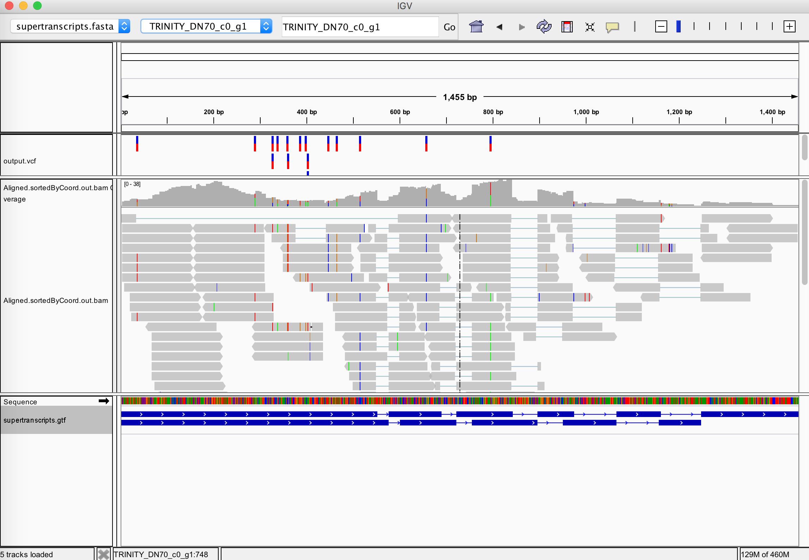

# Variant calling

In Trinity, we provide a script to automatically run the [GATK pipeline for variant calling](https://software.broadinstitute.org/gatk/documentation/article.php?id=3891) using supertranscripts.

Be sure to download and install both Picard and GATK:

* download/install [Picard](https://github.com/broadinstitute/picard/releases/download/2.12.1/picard.jar) and set the installation directory to the environmental variable ${PICARD_HOME}
* [GATK v.3.8](https://software.broadinstitute.org/gatk/download/auth?package=GATK-archive&version=3.8-0-ge9d806836) and set the installation directory to env var ${GATK_HOME}

>Note, the current Trinity release is compatible with GATK v3.8.   We'll be updating it for use with GATK-4 in the next release.

>setting environmental variables on the bash shell involves commands like so: 'export PICARD_HOME=/path/to/picard/dir/'

In addition to having Trinity installed, you'll require [samtools](http://www.htslib.org/) and the [STAR](https://github.com/alexdobin/STAR/releases) aligner.  Both should be available via your PATH setting  (ex. typing 'which STAR' should return the path to the STAR aligner).

Once all tools are installed and environmental variables are set according to the above requirements, assuming you have constructed your supertranscripts, you can run the following script to launch the variant calling pipeline:

     %   ${TRINITY_HOME}/Analysis/SuperTranscripts/AllelicVariants/run_variant_calling.py 

.

        usage: run_variant_calling.py [-h] --st_fa ST_FA --st_gtf ST_GTF
                              (-p PAIRED_READS PAIRED_READS | -s SINGLE_READS)
                              -o OUT_PATH [-l SJDBOVERHANG] [-t NTHREADS]
                              [-m MAXRAM]

    This script requires you have the following dependencies:
    Samtools: "samtools" in your path
    Java: "java" in your path
    Picard-Tools: env var "$PICARD_HOME" with the path to Picard-Tools's bin
    STAR: "STAR" in your path
    GATK: env var "$GATK_HOME" with the path to GATK's bin
    
    optional arguments:
      -h, --help            show this help message and exit
      --st_fa ST_FA, --supertranscript_fasta ST_FA
                            Path to the SuperTranscripts fasta file.
      --st_gtf ST_GTF, --supertranscript_gtf ST_GTF
                            Path to the SuperTranscript gtf file.
      -p PAIRED_READS PAIRED_READS, --paired PAIRED_READS PAIRED_READS
                            Pair of paired ends read files.
      -s SINGLE_READS, --single SINGLE_READS
                            Single reads file.
      -o OUT_PATH, --output OUT_PATH
                            Path to the folder where to generate the output.
      -l SJDBOVERHANG, --sjdbOverhang SJDBOVERHANG
                            Size of the reads (used for STAR --sjdbOverhang). default=150
      -t NTHREADS, --threads NTHREADS
                            Number of threads to use for tools that are multithreaded.
      -m MAXRAM, --maxram MAXRAM
                            Maximum amount of RAM allowed for STAR's genome generation step (only change if you get an error from STAR complaining about this value).

# Example command:

     ${TRINITY_HOME}/Analysis/SuperTranscripts/AllelicVariants/run_variant_calling.py \
               --st_fa supertranscripts.fasta \
               --st_gtf supertranscripts.gtf \
               -p rnaseq_1.fq.gz rnaseq_2.fq.gz \
               -o variant_calls_outdir

# Haplotype Caller output

The Haplotype Caller output is a [standard vcf file](http://www.internationalgenome.org/wiki/Analysis/Variant%20Call%20Format/vcf-variant-call-format-version-40/). By default this script produces the regular vcf file and a filtered vcf as suggested by the GATK guideline: filter clusters of at least 3 SNPs that are within a window of 35 bases between them, using Fisher Strand values (FS > 30.0) and Qual By Depth values (QD < 2.0).
The filtered vcf will still contain all original calls, but the FILTER column will have either PASS for calls that passed all filters, or the name of the filter that they did not pass.

For additional filtering, please refer to the [GATK VariantFiltration documentation](https://software.broadinstitute.org/gatk/documentation/tooldocs/current/org_broadinstitute_gatk_tools_walkers_filters_VariantFiltration.php).   It's common to include additional read depth filters such as requiring at least a coverage depth of 10, and in the case of de novo assembled transcript studies, one might exclude homozygous variants as possible assembly errors (as in [Davidson et al.](https://genomebiology.biomedcentral.com/articles/10.1186/s13059-017-1284-1)).

# Visualization via IGV

You can import the SuperTranscripts fasta file in as the reference genome in IGV along with the SuperTranscripts annotations (gtf), and then load in the STAR-aligned reads (Aligned.sortedByCoord.out.bam) and variants (vcf file) to visualize the variant calls and the read evidence underlying those variant predictions.  An example view is below:

